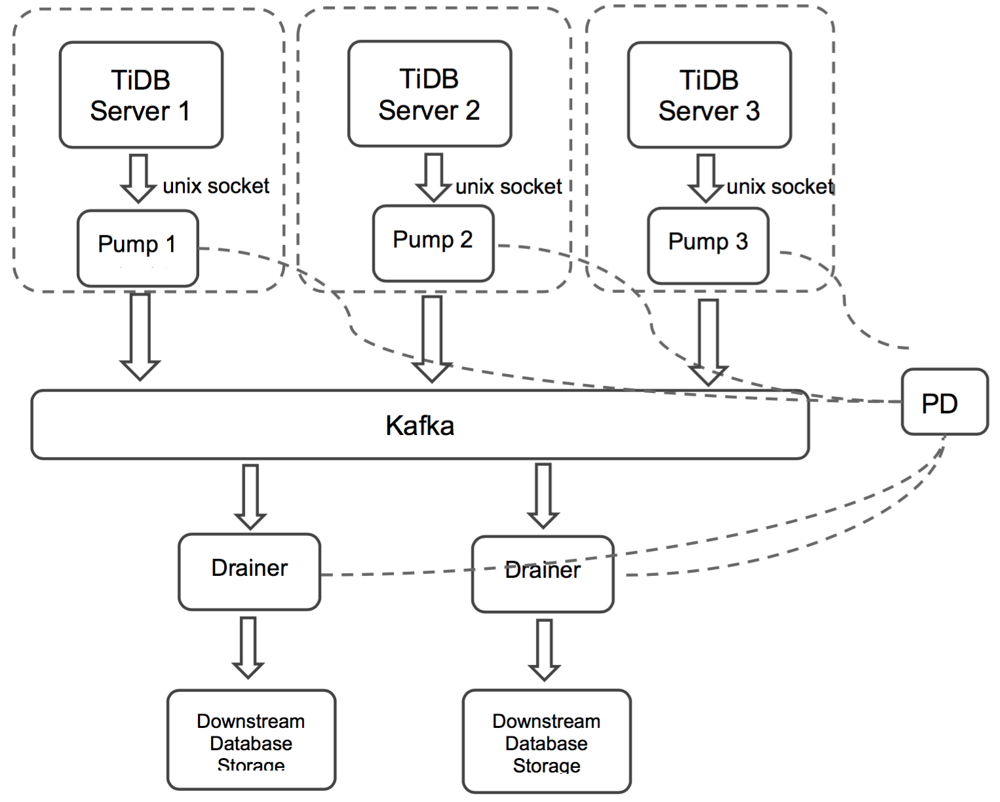
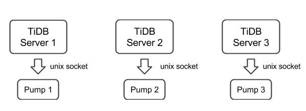

# TiDB-Binlog 部署方案

本文档介绍如何部署 Kafka 版本的 TiDB-Binlog。如需部署 local 版本的 TiDB-Binlog，可参考 [local 版本的 TiDB-Binlog 部署文档](tidb-binlog.md)。

## TiDB-Binlog 简介

TiDB-Binlog 用于收集 TiDB 的 Binlog，并提供实时备份和同步功能的商业工具。

TiDB-Binlog 支持以下功能场景:

* **数据同步**：同步 TiDB 集群数据到其他数据库
* **实时备份和恢复**：备份 TiDB 集群数据，同时可以用于 TiDB 集群故障时恢复

## TiDB-Binlog 架构

首先介绍 TiDB-Binlog 的整体架构。



TiDB-Binlog 集群主要分为三个组件：

#### Pump

Pump 是一个守护进程，在每个 TiDB 主机的后台运行。其主要功能是实时记录 TiDB 产生的 Binlog 并顺序写入 Kafka 中。

#### Drainer

Drainer 从 Kafka 中收集 Binlog，并按照 TiDB 中事务的提交顺序转化为指定数据库兼容的 SQL 语句，最后同步到目的数据库或者写到顺序文件。

#### Kafka & ZooKeeper

Kafka 集群用来存储由 Pump 写入的 Binlog 数据，并提供给 Drainer 进行读取。

> **注：**local 版本将 Binlog 存储在文件中，最新版本则使用 Kafka 存储。

## TiDB-Binlog 安装

### 下载官方 Binary

CentOS 7+

```bash
# 下载压缩包
wget http://download.pingcap.org/tidb-binlog-latest-linux-amd64.tar.gz
wget http://download.pingcap.org/tidb-binlog-latest-linux-amd64.sha256

# 检查文件完整性，返回 ok 则正确
sha256sum -c tidb-binlog-latest-linux-amd64.sha256

# 解开压缩包
tar -xzf tidb-binlog-latest-linux-amd64.tar.gz
cd tidb-binlog-latest-linux-amd64
```

### TiDB-Binlog 部署

#### 注意

* 需要为一个 TiDB 集群中的每台 TiDB server 部署一个 Pump，目前 TiDB server 只支持以 unix socket 的方式输出 Binlog。
* 手动部署时，启动优先级为：Pump > TiDB；停止优先级为 TiDB > Pump。

    我们设置 TiDB 启动参数 binlog-socket 为对应的 Pump 的参数 socket 所指定的 unix socket 文件路径，最终部署结构如下图所示：

    

* Drainer 不支持对 ignore schemas（在过滤列表中的 schemas）的 table 进行 rename DDL 操作。
* 在已有的 TiDB 集群中启动 Drainer，一般需要全量备份并且获取 savepoint，然后导入全量备份，最后启动 Drainer 从 savepoint 开始同步；

    为了保证数据的完整性，在 Pump 运行 10 分钟左右后按顺序进行如下操作：

    *  使用 [tidb-tools](https://github.com/pingcap/tidb-tools) 项目中的 generate_binlog_position 工具生成 Drainer 启动需要的 savepoint 文件中，make generate_binlog_position 编译该工具。具体使用参考工具的 README 说明，也可以直接下载获取该工具：[generate_binlog_position](https://download.pingcap.org/generate_binlog_position-latest-linux-amd64.tar.gz)， 并使用sha256sum验证该文件 [sha256](https://download.pingcap.org/generate_binlog_position-latest-linux-amd64.sha256)。
    *  全量备份，例如 mydumper 备份 TiDB
    *  全量导入备份到目标系统
    *  Kafka 版本 Drainer 启动的 savepoint 默认保存在下游 database tidb_binlog 下的 checkpoint 表中，如果 checkpoint 表中没有效的数据，可以通过设置 `initial-commit-ts` 启动 Drainer 从指定位置开始消费 - `bin/drainer --config=conf/drainer.toml --initial-commit-ts=${commitTS}`

* Drainer 输出的 pb，要在配置文件中设置如下参数：

    ```
    [syncer]
    db-type = "pb"
    disable-dispatch = true

    [syncer.to]
    dir = "/path/pb-dir"
    ```

* Kafka 和 ZooKeeper 集群需要在部署 TiDB-Binlog 之前部署好。Kafka 需要 0.9 及以上版本。

#### Kafka 集群配置推荐

|名字|数量|内存|CPU|硬盘|
|:---:|:---:|:---:|:---:|:---:|
|Kafka|3+|16G|8+|2+ 1TB|
|ZooKeeper|3+|8G|4+|2+ 300G|

#### Kafka 配置参数推荐
    
- auto.create.topics.enable=true 如果还没有创建 topic，Kafka 会在 broker 上自动创建 topic
- broker.id 必备参数用来标识 Kafka 集群，不能重复，如 broker.id = 1
- fs.file-max = 1000000 Kafka 会使用大量文件和网络 socket，建议修改成 1000000，修改方法（vi /etc/sysctl.conf）

#### 使用 tidb-ansible 部署 Pump

- 如无 Kafka 集群，可使用 [kafka-ansible](https://github.com/pingcap/thirdparty-ops/tree/master/kafka-ansible) 部署 Kafka 集群。
- 使用 [TiDB-Ansible](https://github.com/pingcap/tidb-ansible) 部署 TiDB 集群时，修改 `tidb-ansible/inventory.ini` 文件，设置 `enable_binlog = True`，并配置 `zookeeper_addrs` 变量为 Kafka 集群的 ZooKeeper 地址，这样部署 TiDB 集群时会部署 Pump。

配置样例:

```
# binlog trigger
enable_binlog = True
# ZooKeeper address of Kafka cluster, example:
# zookeeper_addrs = "192.168.0.11:2181,192.168.0.12:2181,192.168.0.13:2181"
zookeeper_addrs = "192.168.0.11:2181,192.168.0.12:2181,192.168.0.13:2181"
```

#### 使用 Binary 部署 Pump

使用样例：

假设我们有三个 PD，三个 ZooKeeper，一个 TiDB，各个节点信息如下：

```
TiDB="192.168.0.10"
PD1="192.168.0.16"
PD2="192.168.0.15"
PD3="192.168.0.14"
ZK1="192.168.0.13"
ZK2="192.168.0.12"
ZK3="192.168.0.11"
```

在 ip="192.168.0.10" 的机器上面部署 Drainer/Pump；

对应的 PD 集群的 ip="192.168.0.16,192.168.0.15,192.168.0.14"；

对应的 Kafka 集群的 ZooKeeper 的 ip="192.168.0.13,192.168.0.12,192.168.0.11"。以此为例，说明 Pump/Drainer 的使用。

1. Pump 命令行参数说明

    ```
    Usage of Pump:
    -L string
        日志输出信息等级设置: debug, info, warn, error, fatal (默认 "info")
    -V
        打印版本信息
    -addr string
        Pump 提供服务的 RPC 地址(-addr="192.168.0.10:8250")
    -advertise-addr string
        Pump 对外提供服务的 RPC 地址(-advertise-addr="192.168.0.10:8250")
    -config string
        配置文件路径，如果你指定了配置文件，Pump 会首先读取配置文件的配置；
        如果对应的配置在命令行参数里面也存在，Pump 就会使用命令行参数的配置来覆盖配置文件里面的。
    -data-dir string
        Pump 数据存储位置路径
    -zookeeper-addrs string (-zookeeper_addrs = "192.168.0.11:2181,192.168.0.12:2181,192.168.0.13:2181")
        ZooKeeper 地址，该选项从 ZooKeeper 中获取 Kafka 地址
    -gc int
        日志最大保留天数 (默认 7)，设置为 0 可永久保存
    -heartbeat-interval uint
        Pump 向 PD 发送心跳间隔 (单位 秒)
    -log-file string
        log 文件路径
    -log-rotate string
        log 文件切换频率，hour/day
    -metrics-addr string
        Prometheus pushgataway 地址，不设置则禁止上报监控信息
    -metrics-interval int
        监控信息上报频率 (默认 15，单位 秒)
    -pd-urls string
        PD 集群节点的地址 (-pd-urls="http://192.168.0.16:2379,http://192.168.0.15:2379,http://192.168.0.14:2379")
    -socket string
        unix socket 模式服务监听地址（默认 unix:///tmp/pump.sock）
    ```

2. Pump 配置文件

    ```toml
    # Pump Configuration.

    # Pump 提供服务的 RPC 地址("192.168.0.10:8250")
    addr = "192.168.0.10:8250"

    # Pump 对外提供服务的 RPC 地址("192.168.0.10:8250")
    advertise-addr = ""
    
    # binlog 最大保留天数 (默认 7)，设置为 0 可永久保存
    gc = 7
 
    # Pump 数据存储位置路径
    data-dir = "data.pump"
 
    # ZooKeeper 地址，设置该选项从 ZooKeeper 中获取 Kafka 地址
    # ZooKeeper-addrs = "192.168.0.11:2181,192.168.0.12:2181,192.168.0.13:2181"

    # Pump 向 PD 发送心跳的间隔 (单位 秒)
    heartbeat-interval = 3
   
    # PD 集群节点的地址
    pd-urls = "http://192.168.0.16:2379,http://192.168.0.15:2379,http://192.168.0.14:2379"
 
    # unix socket 模式服务监听地址 (默认 unix:///tmp/pump.sock)
    socket = "unix:///tmp/pump.sock"
    ```

3. 启动示例

    ```bash
    ./bin/pump -config pump.toml
    ```

#### 使用 Binary 部署 Drainer

1. Drainer 命令行参数说明

    ```
    Usage of Drainer:
    -L string
        日志输出信息等级设置：debug, info, warn, error, fatal (默认 "info")
    -V
        打印版本信息
    -addr string
        Drainer 提供服务的地址(-addr="192.168.0.10:8249")
    -c int
        同步下游的并发数，该值设置越高同步的吞吐性能越好 (default 1)
    -config string
        配置文件路径，Drainer 会首先读取配置文件的配置；
        如果对应的配置在命令行参数里面也存在，Drainer 就会使用命令行参数的配置来覆盖配置文件里面的
    -data-dir string
        Drainer 数据存储位置路径 (默认 "data.drainer")
    -zookeeper-addrs string (-zookeeper-addrs="192.168.0.11:2181,192.168.0.12:2181,192.168.0.13:2181")
        ZooKeeper 地址，该选项从 ZooKeeper 中获取 Kafka 地址
    -dest-db-type string
        Drainer 下游服务类型 (默认为 mysql)
    -detect-interval int
        向 PD 查询在线 Pump 的时间间隔 (默认 10，单位 秒)
    -disable-dispatch
        是否禁用拆分单个 binlog 的 sqls 的功能，如果设置为 true，则按照每个 binlog
        顺序依次还原成单个事务进行同步（下游服务类型为 mysql，该项设置为 False）
    -ignore-schemas string
        db 过滤列表 (默认 "INFORMATION_SCHEMA,PERFORMANCE_SCHEMA,mysql,test")，
        不支持对 ignore schemas 的 table 进行 rename DDL 操作
    -initial-commit-ts (默认为 0)
        如果 Drainer 没有相关的断点信息，可以通过该项来设置相关的断点信息
    -log-file string
        log 文件路径
    -log-rotate string
        log 文件切换频率，hour/day
    -metrics-addr string
        Prometheus pushgataway 地址，不设置则禁止上报监控信息
    -metrics-interval int
        监控信息上报频率（默认 15，单位 秒）
    -pd-urls string
        PD 集群节点的地址 (-pd-urls="http://192.168.0.16:2379,http://192.168.0.15:2379,http://192.168.0.14:2379")
    -txn-batch int
        输出到下游数据库一个事务的 SQL 数量（默认 1）
    ```

2. Drainer 配置文件

    ```toml
    # Drainer Configuration.

    # Drainer 提供服务的地址("192.168.0.10:8249")
    addr = "192.168.0.10:8249"

    # 向 PD 查询在线 Pump 的时间间隔 (默认 10，单位 秒)
    detect-interval = 10

    # Drainer 数据存储位置路径 (默认 "data.drainer")
    data-dir = "data.drainer"

    # ZooKeeper 地址，该选项从 ZooKeeper 中获取 kafka 地址
    # zookeeper-addrs = "192.168.0.11:2181,192.168.0.12:2181,192.168.0.13:2181"

    # PD 集群节点的地址
    pd-urls = "http://192.168.0.16:2379,http://192.168.0.15:2379,http://192.168.0.14:2379"

    # log 文件路径
    log-file = "drainer.log"

    # Syncer Configuration.
    [syncer]

    ## db 过滤列表 (默认 "INFORMATION_SCHEMA,PERFORMANCE_SCHEMA,mysql,test"),
    ## 不支持对 ignore schemas 的 table 进行 rename DDL 操作
    ignore-schemas = "INFORMATION_SCHEMA,PERFORMANCE_SCHEMA,mysql"

    # 输出到下游数据库一个事务的 SQL 数量 (default 1)
    txn-batch = 1

    # 同步下游的并发数，该值设置越高同步的吞吐性能越好 (default 1)
    worker-count = 1

    # 是否禁用拆分单个 binlog 的 sqls 的功能，如果设置为 true，则按照每个 binlog
    # 顺序依次还原成单个事务进行同步（下游服务类型为 mysql, 该项设置为 False）
    disable-dispatch = false

    # Drainer 下游服务类型（默认为 mysql）
    # 参数有效值为 "mysql", "pb"
    db-type = "mysql"

    # replicate-do-db prioritizes over replicate-do-table when they have the same db name
    # and we support regex expressions,
    # 以 '~' 开始声明使用正则表达式

    #replicate-do-db = ["~^b.*","s1"]

    #[[syncer.replicate-do-table]]
    #db-name ="test"
    #tbl-name = "log"

    #[[syncer.replicate-do-table]]
    #db-name ="test"
    #tbl-name = "~^a.*"

    # db-type 设置为 mysql 时，下游数据库服务器参数
    [syncer.to]
    host = "192.168.0.10"
    user = "root"
    password = ""
    port = 3306

    # db-type 设置为 pb 时，存放 binlog 文件的目录
    # [syncer.to]
    # dir = "data.drainer"
    ```

3. 启动示例

    ```bash
    ./bin/drainer -config drainer.toml
    ```

## 下载 PbReader 工具 (Linux)

PbReader 用于解析 Drainer 生成的 Pb 文件，并翻译成对应的 SQL 语句。

CentOS 7+

```bash
# 下载 PbReader 压缩包
wget http://download.pingcap.org/pb_reader-latest-linux-amd64.tar.gz
wget http://download.pingcap.org/pb_reader-latest-linux-amd64.sha256

# 检查文件完整性，返回 ok 则正确
sha256sum -c pb_reader-latest-linux-amd64.sha256

# 解开压缩包
tar -xzf pb_reader-latest-linux-amd64.tar.gz
cd pb_reader-latest-linux-amd64
```

PbReader 使用示例

```bash
./bin/pbReader -binlog-file=binlog-0000000000000000
```

## TiDB-Binlog 监控

本部分主要介绍如何对 TiDB-Binlog 的状态、性能做监控，并通过 Prometheus + Grafana 展现 metrics 数据。

### Pump/Drainer 配置

使用 Ansible 部署的 Pump 服务已经在启动参数设置 metrics。启动 Drainer 时可以设置以下两个参数：

- `--metrics-addr`：设为 Push Gateway 的地址
- `--metrics-interval`：设为 push 的频率，单位为秒，默认值为 15

### Grafana 配置

+ 进入 Grafana Web 界面（默认地址: `http://localhost:3000`，默认账号：admin，密码：admin）

    点击 Grafana Logo -> 点击 Data Sources -> 点击 Add data source -> 填写 data source 信息
    
    > **注：**Type 选 Prometheus，URL 为 Prometheus 地址，根据实际情况 添加/填写 ）

+ 导入 dashboard 配置文件

    点击 Grafana Logo -> 点击 Dashboards -> 点击 Import -> 选择需要的 [dashboard 配置文件](https://github.com/pingcap/docs/tree/master/etc)上传 -> 选择对应的 data source
